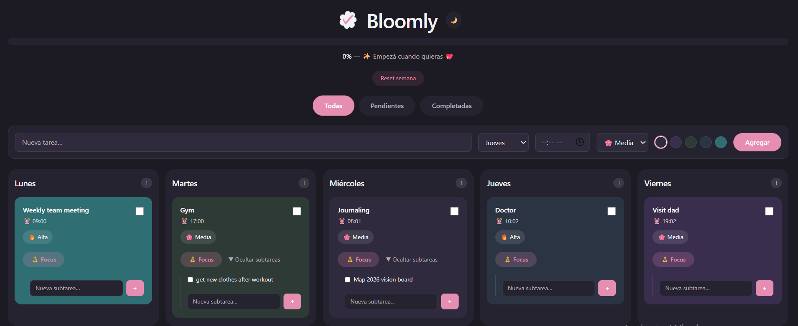
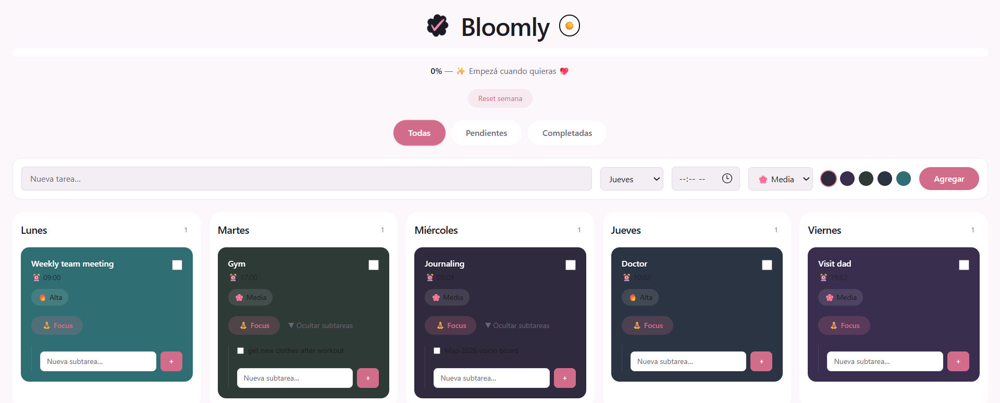

# 🌸 Bloomly

Bloomly is a weekly planning app designed to help organize and track tasks.  
It combines day-based organization, priorities, subtasks, and a Focus mode.

## ✨ Features
- Weekly planning (Monday to Friday)
- Filters: all / pending / completed
- Subtasks per task
- Optional time scheduling
- Priority levels (High / Medium / Low)
- Focus Mode with timer
- Weekly progress bar with motivational feedback
- Light / Dark mode
- Drag & Drop task reordering

## 🛠 Tech Stack
- React
- Vite
- Tailwind CSS
- Zustand
- Framer Motion
- @dnd-kit

## 🚀 Demo
https://bloomly.vercel.app

## 📸 Preview
**Dark mode:**  

**Light mode:**  

## 👩‍💻 Author
Created by **Mikaela Estefan**

- GitHub: https://github.com/MikaelaEstefan
